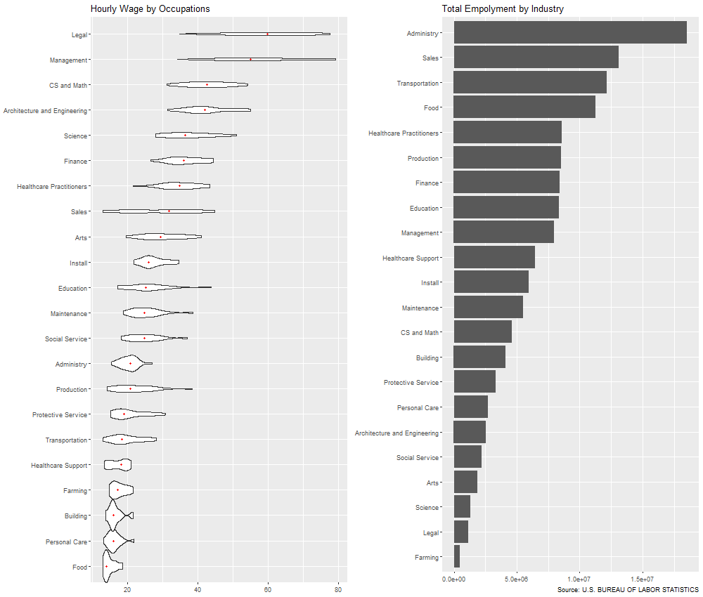

```{r, include=FALSE}
library(knitr)
library(dplyr)
library(kableExtra)
select <- dplyr::select
knitr::opts_chunk$set(echo = FALSE)

defOut <- knitr::knit_hooks$get("plot")  # save the default plot hook 
knitr::knit_hooks$set(plot = function(x, options) { 
  x <- defOut(x, options)  # apply the default hook
  if(!is.null(options$wrapfigure)) {
    # create the new opening string for the wrapfigure environment ...
    wf <- sprintf("\\begin{wrapfigure}{%s}{%g\\textwidth}", options$wrapfigure[[1]], options$wrapfigure[[2]])
    x  <- gsub("\\begin{figure}", wf, x, fixed = T)  # and replace the default one with it.
    x  <- gsub("{figure}", "{wrapfigure}", x, fixed = T)  # also replace the environment ending
  }
  return(x)
})

```

# 1. Introduction

Since COVID-19 hit the world in early 2020, people has been trying to fight against the virus and to return business to normal throughout the whole year. Given such an unusual time, it is worthehile to take a snapshot of the labor market in 2020 and analyze how people in different industries and occupations are paid. In additon, under rapid, technology-driven changes, it would be interesting to see if high-paying jobs are in accordance with the ones less likely to be automated by machines in the future. Also, if automation will affect many people in the job market. 

With the above interests, we focus on the labor market in the United States in the year 2020. The parameters of interest are total employment and mean hourly wage. Our primary source data is from U.S. Bureau of Labor Statistics[1]. There are four sections of analysis centered around our parameter of interest. In the first section, we categorize our data by industry according to the North American Industry Classification System (NAICS)[2] and analyze the distribution of hourly wage within each industry. In the second section, we categorize our data based on the six-digit 2018 Standard Occupational Classification (SOC) code[3]. Occupation is different from industry in that the former is about what type of business one works for, while the latter is about the specific type of work or job the person does. Therefore, industry and occupation are two perspectives to look at the work one is involved. In the third section, we group the data by state and focus on the spatial pattern of total employment and income level across states. In the fourth section, we combine employment data with estimated automation probability score (Frey & Osborne, 2017)[4] and investigate the relationship between salary, employment, and the predicted chance of automation across occupations.


# 2. Analysis  

## 2.1 Salary and Total Employment across Industry

Industries are grouped by the NAICS code. Overall, in 2020 in the United States, there are 139,099,570 employments with a mean hourly wage of \$27.07 (median \$20.17), mean annual wage $56,310. These statistics above includes private, federal, state, and local ownership. Within private ownership, there are 117,718,070 employments with a mean hourly wage of \$26.56 (median \$19.19). NAICS further breaks down the private ownership group into 20 sectors indicated by a two-digit code. The hourly wage salary distribution within each sector is shown in the figure below. 

All the income distributions are skewed to the right, with much fewer people at the higher end. This phenomenon is in accordance with many empirical results as well as theoretical underpinnings (Benhabib, 2018)[4]. Focusing on the medians of mean hourly wage, we can see that Information, Finance, Traditional Energy, and Science and Technology are the top-earning industries with no surprise. Regarding the shape of the distributions, it makes sense that the salary for Government jobs is more centered together. There is no position that earns a significantly higher amount than others. In industries such as Information, Arts, and Science and Technology, there are few people that earn much more than the averages. Results from the figure is in conformity with our intuition.

The figure on the right shows total employment across industries. Agriculture was the smallest sector within the private ownership group, while Health and Social Care is the largest. The largest sectors, such as Education, Manufacture, Trade, Food, and Government, tend to be the ones playing a more fundamental role to human society.

```{r, fig.width=10, fig.height = 7, out.width = "1\\textwidth", fig.cap = "Hourly Wage Distributions and Total Employment across Industries", fig.pos = "H", fig.align='center'}

```


**Utility Sector**

The Utility sector being the top-earning industry may seem surprising. According to NAICS, the Utilities sector comprises establishments engaged in the provision of the following utility services: electric power, natural gas, steam supply, water supply, and sewage removal. In other words, this sector includes companies providing basic amenities. Within this sector, the specific activities associated with the utility services provided vary by utility but generally includes power generation, transmission, and distribution. 

```{r, fig.width=6, fig.height = 3, out.width = ".6\\textwidth", fig.cap = "Mean Hourly Wage in Different Occupations Within the Utility Sector", fig.pos = "H", fig.align='center'}

```

Figure 2 shows a detailed breakdown within the Utility sector. Each rectangle corresponds to one occupation (by the SOC classification system), with size indicating the total employment and color indicating the mean hourly wage. Within this industry, legal position reaches a mean hourly wage of \$71.89 and management positions reaches \$68.82. Despite both have a similar mean hourly wage, the number of workers across the two are very different. Legal position has total employment of 1,540 whereas that of management is 42,320. Administrative, maintenance, and production are the three biggest occupation groups, with total employment of 148,400, 82,710, and 77,430 respectively; however, the mean hourly wages for the three occupations are all around the overall median within the Utility industry. Specifically, the numbers are \$38.61, \$27.03, and \$38.32.


## 2.2 Salary and Total Employment across Occupation

Different from industry, occupation is more about the type of work a person does. There are multiple occupations within an industry, and one type of occupation can be found in many industries. In the dataset from the U.S. Bureau of Labor Statistics, one industry and occupation combination points to one unique row. In this section, we group our data by occupation based on the six-digit SOC code to look at the job market through a different angle. There are 23 major groups, each indicated by a unique 2 digits. The other 4 digits are used to sub-categorize the major groups. 

```{r, fig.width=10, fig.height = 7, out.width = "1\\textwidth", fig.cap = "Hourly Wage Distributions and Total Employment across Occupations", fig.pos = "H", fig.align='center'}

```

Similar with Figure 1 where we group our data by industry, we can see that Food and Agriculture jobs are at the lower end of the income distribution while jobs related to legal, finance, and science are paid more. In addition, occupations that have a higher median hourly wage seems to have a distribution more spread out. The skewness of the income distribution is less obvious, and the difference in median hourly wage across different occupations are more noticeable compared with that categorized by the NAICS code. This suggests that changing occupation, the type of work one does, rather than the industry one involves in, is more likely to bring about a greater change in salary. 

**Data-related occupations**

```{r, fig.width=10, fig.height = 7, out.width = "1\\textwidth", fig.cap = "Scatter Plot of Hourly Wage and Employment of Data-related Occupations", fig.pos = "H", fig.align='center'}
include_graphics("./figures/figure23.png")

tb <- read.csv("./derived_data/DS_broad_group.csv") %>% mutate(Occupation = OCC_TITLE,
      Hourly_Mean = H_MEAN, Annual_Mean = A_MEAN) %>% 
  select(Occupation, Hourly_Mean, Annual_Mean, TOT_EMP)
kbl(tb, booktabs = T, digits=2, format.args = list(big.mark= ','))
```

With an interest of data-related occupations, we take a closer look at broad occupation level. Selected occupations include Data Scientists, Statisticians, Operations Research Analysts, Database and Network Administrators and Architects, Software and Web Developers, Programmers, and Testers, etc. As listed in the table below, employment is much higher for Software and Web Developers, Programmers, and Testers (total employment 9,359,690) compared with other data-related occupations. Mathematicians are rare with a total employment of only 14,470, their hourly wage though, \$48.9, is not on the extremes. Computer and Information Research Scientists earns the most in this selected subgroup. Their hourly mean wage reaches \$60.1, and their mean annual wage reaches as high as \$125,075.


## 2.3 Salary and Total Employment across States

In this section, we group our data by state to see if there is any spatial pattern regarding the labor market. From the map, we can see that, Washington D.C., California, Washington Seattle, and a cluster of states around New York earn a relatively high salary nation-wide. States from the west coast to the ones sharing border with Mexico, and states near the five great lakes, and Colorado constitute to the second tire of the top-earning states. States located across the diagonal of the US map are at the lower end of hourly income.

```{r, fig.width=10, fig.height = 7, out.width = "1\\textwidth", fig.cap = "Spatial Map of Hourly Wage and Employment", fig.pos = "H"}

```

The spatial pattern for total employment is similar to that of the mean hourly wage with some exceptions. Specifically, Florida and Texas, despite having a low mean hourly wage, have a high total employment nationwide. It might be because industries with a lower salary such as manufacturing are located in these states. The opposite is true for Washington D.C. which has a high-income level with a low employment level. This is possibly due to its high concentration on jobs related to the government. On the west coast, although Washington Seattle and Oregon have a relatively high hourly wage, employment in the two states are around average. California and New York, as one might suspect, are two states with high salary and high total employment. 

```{r, fig.width=8.5, fig.height = 6, out.width = ".85\\textwidth", fig.cap = "Scatter Plot by State", fig.pos = "H", fig.align='center'}

```

The scatter plot below provides a more intuitive visualization for employment vs hourly wage. In accordance with our observations from the maps, DC, CA, NY, TX, and FL are the outliers. Other states are clustered together at the lower left corner of the figure, with neither a remarkable total employment nor a remarkable hourly wage. 

## 2.4 Relationship between Employment and Chances of Future Automation

With the rapid advances in technology--specifically, as artificial intelligence and robotics begin to overtake an increasing amount of cognitive and manual tasks—it is naturally to ask if the occupations being affected most strongly are the ones being paid more. Moreover, if there exists any correlation between the predicted degree of automation and wage.

Before going into the analysis part, it is important to understand the automation score calculated in the paper: the future of employment: How susceptible are jobs to computerisation?. In the study, Frey and Osborne used both subjective and objective measures. The Subjective part comes from subjectively hand-labeling occupations as automatable. This was accomplished by asking if the tasks of this job can be sufficiently specified, conditional on the availability of big data, and to be performed by state-of-the-art computer-controlled equipment. The objective part was obtained by calculating the bottlenecks to computerization using O*NET variables. Competencies in the level of perception and manipulation, creativity, and social intelligence are considered impossible to be undertaken by machines. 

Using the model described above, they obtain automation score for the major occupations is shown in the figure below. Production, Administrative, Installation, Maintenance, and Transportation are the ones having high automation scores. Production, with a score of 84.9, almost doubles the automation score of administrative jobs, the second highest one. Management and Social Service are ranked the lowest. Their scores are even below 1.

Although it seems plausible that automation score might be related to earning level, We can hardly see any linear relationship between automation score and total employment as well as between automation score and hourly wage, even if we exclude Production as an outlier.

To take a closer look, we plot automation score by mean hourly wage using a scatter plot, using total employment as the relative size for the scatters. In accordance with results from the table, we can see that legal positions are categorized by low automation score, low total employment, and high hourly wage. Same is true for jobs related to CS, Math, and Engineering, although their hourly wage is not as high as that of legal jobs.

```{r, out.width='.49\\linewidth', fig.width=3, fig.height=3, fig.show='hold',fig.align='center'}


```

# Conclusion

This report provides an overview of the labor market in US in 2020 through the prespective of industry, occupation, and location. In addtion to that, it investigates the relationship between employment, hourly wage and estimated impact from automation. A skewed income distribution is found in every industry. Jobs that requires more creativity and more professional expertise in the private ownership sectors tends to have a more spread out salary distribution as well as a higher salary level. Those includes Legal, Management, Science, Engineering, Computer Science and Math related positions. Besides, sectors related to traditional engery are also high-paying. In 2020, employment in agricultural and farming was the smallest while that of manufacture, sales, food, transportation, and health and social care are some of the largest. Moreover, spatial patterns can be seen in both employment and hourly wage--states near the coast hold more jobs with a higher salary compared to states near the middle. Washington DC is characterized by a remarkably high mean hourly wage and small employemnt; New York and California are marked by high employment and high hourly wage; and Florida and Texas stood out for having a relatively lower hourly wage but high employment. Little correlation can be found between the impact level of automation and hourly wage, suggesting the underling factors for the two might be different. 

# Data source and Reference

**1. Salary Data:**

  https://www.bls.gov/oes/special.requests/oesm20all.zip 
  from: U.S. BUREAU OF LABOR STATISTICS

**2. 2017 North American Industry Classification System (NAICS):**

  https://www.census.gov/naics/?58967?yearbck=2017
  from: U.S. Census Bureau

**3. 2018 Standard Occupational Classification (SOC) System:** 
  
  https://www.bls.gov/soc/
  from: U.S. Bureau of Labor Statistics
  
**4. Automation Probability Data:**

  https://www.kaggle.com/andrewmvd/occupation-salary-and-likelihood-of-automation 
  from: The future of employment: How susceptible are jobs to computerisation? 
  DOI: 10.1016/j.techfore.2016.08.019 
  Journal: Technological Forecasting and Social Change
  Volume: 114
  Author: Frey, Carl Benedikt and Osborne, Michael A.
  Year: 2017
  Pages: 254–280
  
**5. Github repository:** 

  git\@github.com:yatingz205/bios-611-project.git
